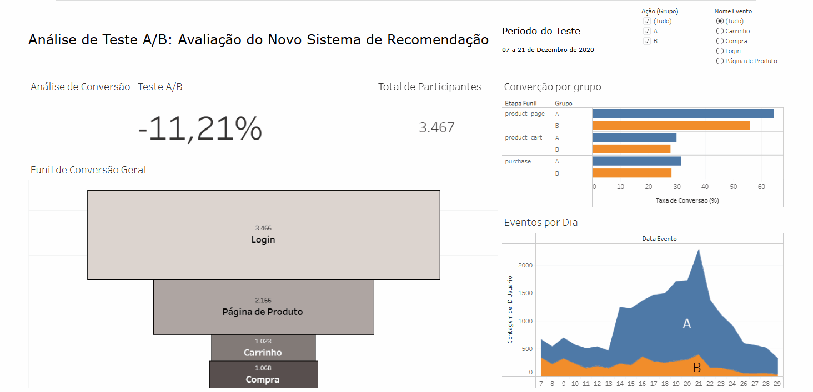

# Projeto Final de Análise de Dados

Este repositório contém a análise de dados realizada como projeto final, abrangendo um Teste A/B para um novo sistema de recomendação, uma Análise SQL do mercado editorial e um dashboard interativo para visualização dos resultados.

## 🖼️ Visualizações Chave

<table>
  <tr>
    <td align="center">
      
      <br />
      <em>Dashboard Interativo no Tableau: Visualização dos resultados do Teste A/B, comparando o funil de conversão e taxas entre os grupos.</em>
    </td>
    <td align="center">
      
      <br />
      <em>Apresentação Resumida: Principais insights e recomendações do Teste A/B.</em>
    </td>
  </tr>
</table>

## 📜 Sumário

*   [Visão Geral do Projeto](#-visão-geral-do-projeto)
*   [Componentes do Projeto](#-componentes-do-projeto)
    *   [1. Análise de Teste A/B](#1-análise-de-teste-ab)
    *   [2. Análise SQL do Mercado Editorial](#2-análise-sql-do-mercado-editorial)
    *   [3. Dashboard Interativo (Tableau)](#3-dashboard-interativo-tableau)
*   [🛠️ Tecnologias Utilizadas](#️-tecnologias-utilizadas)
*   [📂 Estrutura do Projeto](#-estrutura-do-projeto)
*   [🚀 Como Executar/Reproduzir](#-como-executarreproduzir)

## 🌟 Visão Geral do Projeto

O objetivo deste projeto é aplicar conhecimentos em análise de dados para resolver problemas de negócios, analisando um teste A/B inconcluso e explorando um banco de dados de um concorrente para fornecer recomendações acionáveis.

## 🧩 Componentes do Projeto

### 1. Análise de Teste A/B: Avaliação do Novo Sistema de Recomendação

Análise de um teste A/B para avaliar a eficácia de um novo sistema de recomendação de produtos em uma loja online.

*   **Contexto:** Teste A/B (7-21 Dez 2020) com novos usuários divididos entre sistema antigo (Grupo A) e novo (Grupo B). Resultados iniciais inconclusos.
*   **Objetivos:** Verificar conformidade, analisar funil (`product_page` → `product_cart` → `purchase`), determinar impacto estatístico do Grupo B, avaliar meta de +10% na conversão e recomendar ações.
*   **Metodologia:** Pré-processamento, verificação de consistência (região, datas, participantes), AED, tratamento de outliers e Teste Z para proporções com correção de Bonferroni.
*   **Principais Achados e Recomendações:**
    *   Grupo B (novo sistema) teve taxas de conversão **inferiores** ao Grupo A.
    *   Queda na conversão para `product_page` no Grupo B foi **estatisticamente significativa**.
    *   Diferenças para `product_cart` e `purchase` não foram estatisticamente significativas com alfa corrigido.
    *   Novo sistema **não atingiu a meta de +10% de aumento**, resultando em quedas.
    *   **Recomendação Principal:** Não implementar o novo sistema. Reexecutar o teste A/B corrigindo falhas na coleta e configuração.
*   **Desafios:** Discrepância de região (dados EUA vs alvo UE), número de participantes abaixo do esperado, desbalanceamento dos grupos.

### 2. Análise SQL do Mercado Editorial

Análise de um banco de dados de um serviço concorrente para insights no desenvolvimento de um novo aplicativo para leitores.

*   **Contexto (SQL):** Análise de banco de dados com informações sobre livros, autores, editoras, avaliações e resenhas.
*   **Objetivos (SQL):** Quantificar publicações pós-2000, mapear desempenho de livros, identificar editoras e autores de destaque, analisar comportamento de usuários ativos.
*   **Metodologia (SQL):** Consultas SQL (JOINs, GROUP BY, CTEs, etc.) em PostgreSQL para agregar e analisar dados.
*   **Principais Achados e Recomendações (SQL):**
    *   ~82.1% do acervo do concorrente publicado após 2000.
    *   "Penguin Books" destacou-se com mais livros longos (+50 páginas).
    *   J.K. Rowling/Mary GrandPré com maior média de classificação (critério: livros com >= 6 classificações).
    *   Usuários mais ativos (>50 avaliações) escrevem, em média, ~24 resenhas textuais.
    *   **Recomendação Principal:** O novo app deve focar em acervo moderno, parcerias com editoras prolíficas (ex: Penguin Books) e desenvolver funcionalidades para engajar "superusuários".
*   **Limitações:** Inconsistência em nomes de editoras e agrupamento de co-autores.

### 3. Dashboard Interativo (Tableau)

Um dashboard foi criado no Tableau para visualizar os resultados e as principais métricas do Teste A/B.

*   **Link para o Dashboard:** [https://public.tableau.com/views/Livro2_17499450325230/Painel1?:language=pt-BR&publish=yes&:sid=&:redirect=auth&:display_count=n&:origin=viz_share_link](https://public.tableau.com/views/Livro2_17499450325230/Painel1?:language=pt-BR&publish=yes&:sid=&:redirect=auth&:display_count=n&:origin=viz_share_link)
*   **Descrição:** Apresenta o funil de conversão comparativo (A vs B) e métricas chave do Teste A/B.

## 🛠️ Tecnologias Utilizadas

*   **Python 3:** Pandas, Plotly, Statsmodels, SQLAlchemy
*   **SQL (PostgreSQL)**
*   **Jupyter Notebook**
*   **Tableau Public**
*   **Markdown**

## 📂 Estrutura do Projeto

```
Projeto_Final_Analise_Dados/
├── AB_Test_Analysis/
│   ├── AB Test.ipynb                  # Notebook da análise do Teste A/B
│   ├── Decomposição.md                # Plano de ação para o Teste A/B
│   └── datasets/                      # Arquivos .csv para o Teste A/B
│       ├── ab_project_marketing_events_us.csv
│       ├── final_ab_events_upd_us.csv
│       ├── final_ab_new_users_upd_us.csv
│       └── final_ab_participants_upd_us.csv
├── SQL_Editorial_Analysis/
│   └── Projeto SQL.ipynb              # Notebook da análise SQL
├── images/                            # GIFs e outras imagens do projeto
│   ├── dashboard.gif
│   └── AB teste .gif
└── README.md                          # Este arquivo
```
*(Nota: A estrutura do projeto foi simplificada para clareza. O `Decomposição.md` do diretório raiz e o subdiretório `Projeto final/` aninhado foram omitidos por parecerem duplicados ou de outro contexto, conforme a estrutura original apresentada).*

## 🚀 Como Executar/Reproduzir

1.  **Pré-requisitos:**
    *   Python 3.x e bibliotecas listadas (instale com `pip install pandas plotly statsmodels sqlalchemy psycopg2-binary`).
    *   Acesso a um servidor PostgreSQL (para `Projeto SQL.ipynb`).

2.  **Análise de Teste A/B:**
    *   Clone o repositório.
    *   Navegue para `AB_Test_Analysis/`.
    *   Execute `AB Test.ipynb` no Jupyter.

3.  **Análise SQL:**
    *   Clone o repositório.
    *   Navegue para `SQL_Editorial_Analysis/`.
    *   Configure as credenciais do banco de dados `db_config` em `Projeto SQL.ipynb`.
    *   Execute o notebook.

4.  **Dashboard Tableau:**
    *   Acesse o link público na seção [Dashboard Interativo (Tableau)](#3-dashboard-interativo-tableau).
